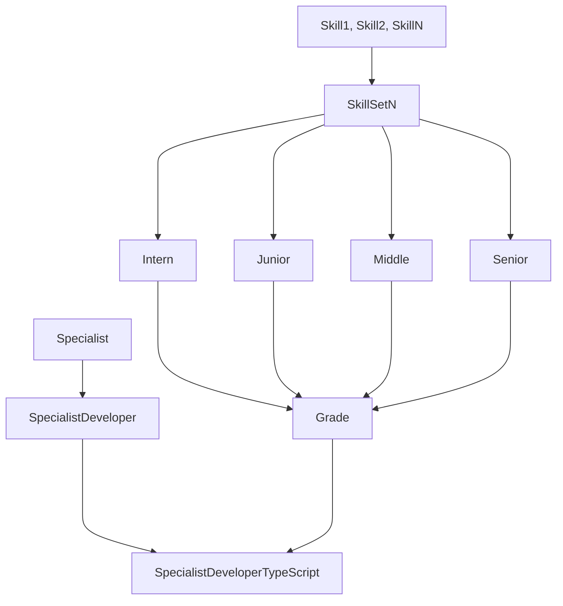

# Specialist

Это сущность, которая описывает требования к самой себе, на основе [[Grade | грейда]] и [[Skill | умений]]. Если говорить проще, то специлист — это набор умений и грейда для определённой профессии или специальности. 

В общем, предполагаются следующие фундаментальные специальности: 

- [[SpecialistDesigner]]
- [[SpecialistDeveloper]]
- [[SpecialistManager]]
- [[SpecialistQA]]

>[!note] Внимание!
>
> В рамках [[MVP]], ведётся работа только с одной фундаментальной специальностью — Developer. 

Каждая фундаментальная специальность, содержит в себе *«подспециальность»*, или профессию.

Например, [[SpecialistDeveloper]] содержит в себе подспециальности: 

- Flutter Developer
- Go Developer
- Java Developer
- JS Developer
- Kotlin Developer
- PHP Developer
- Swift Developer
- [[SpecialistDeveloperTypeScript | TypeScript Developer]]

При этом набор — [[Skill | умение]] / [[Grade | грейд]] для каждой подспециальности свой. Просто потому что, требования к умениям у каждой подспециальности и каждого грейда свои. 

## Если попытаться изобразить графически

